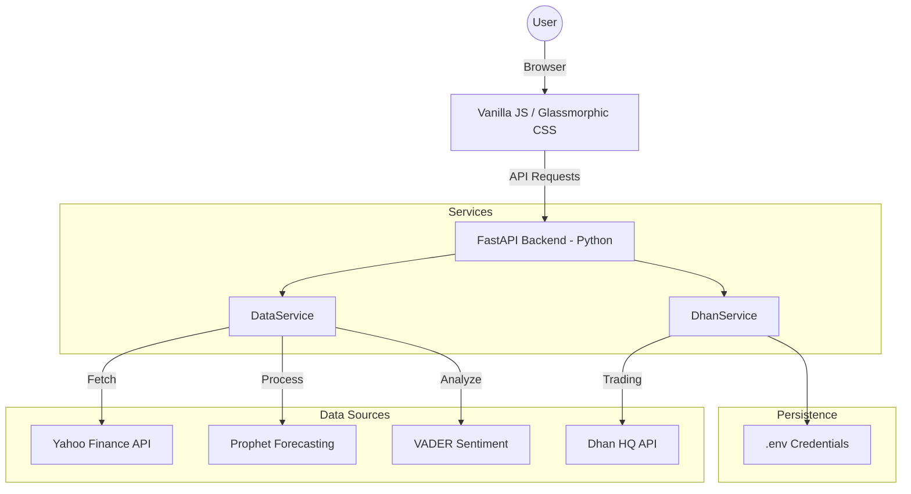

# AI Financial Analytics & Trading Assistant (Sprint 1)

A premium, glassmorphic AI-powered command center for financial analytics, sentiment tracking, and live trading via **Dhan HQ**.

---

## 🚀 Overview
This project is an advanced financial assistant that evolves through five personas, from a simple data observer to an executive trading assistant. It provides real-time NSE data enriched with technical analysis, AI-driven price forecasting, news sentiment tracking, and a secure live trading interface.

### The Personas
1.  **The Observer**: Real-time NSE data ingestion (`yfinance`).
2.  **The Analyst**: Automated technical indicators (SMA, RSI, MACD).
3.  **The Strategist**: News sentiment analysis (VADER).
4.  **The Advisor**: 7-day predictive forecasting (Facebook Prophet).
5.  **The Executive**: Live trading, portfolio tracking, and AI-assisted orders (Dhan HQ).

---

## 🏗️ Architecture



---

## 🛠️ Getting Started

### 1. Prerequisites
*   Python 3.9+
*   Dhan Client ID & Access Token (for Phase 5 features)

### 2. Installation
```bash
# Navigate to the project directory
cd Finance_Projects

# Install dependencies
pip3 install fastapi uvicorn yfinance pandas pandas_ta vaderSentiment prophet dhanhq python-dotenv
```

### 3. Environment Configuration
Create a `.env` file from the example:
```bash
cp .env.example .env
```
Fill in your Dhan credentials in the `.env` file:
*   `DHAN_CLIENT_ID`: Your Dhan Client ID.
*   `DHAN_ACCESS_TOKEN`: Your Dhan Access Token.

### 4. Run the Server
```bash
PYTHONPATH=. python3 backend/main.py
```
Access the dashboard at: **http://localhost:8000**

---

## 📖 Detailed Guides
*   **[User & System Guide](SYSTEM_GUIDE.md)**: Logic, interpretation, and algorithm deep-dives.
*   **[Developer Reference](DEVELOPER.md)**: API endpoints, data shapes, and component maps.

---

> [!CAUTION]
> **Trading Risk**: This tool is for research and analytics assistancce. Trading involves risk. Ensure you have whitelisted your IP on the Dhan HQ portal before attempting live orders.
